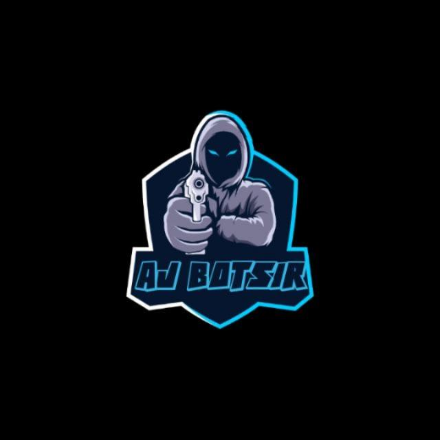

## [](https://git.io/typing-svg)

<div align="center">
  
  <p align="center">
<a href="#"></a>
</p>
  <p align="center">
<a href="https://github.com/NIHALJASI"></a>
</p>
</div>
<p align="center">
Project created by <a href="https://github.com/NIHALJASI">NIHALJASI</a> to make it public
    <br>
       | © |
        Reserved |
    <br> 
</p>


## Setup
<div align="center">

  ### Simple Method
 
[](https://replit.com/@Husniser/MAALUTTY-QR)
  

[](https://heroku.com/deploy?template=https://github.com/NIHALJASI/☠︻╦̵̵͇̿̿̿̿╤─AJ-BOT-SIR࿐☠) 
 
### The Hard Method
```js
GET QR
$ apt install git
$ apt install nodejs --fix-missing
$ git clone https://github.com/NIHALJASI/☠︻╦̵̵͇̿̿̿̿╤─AJ-BOT-SIR࿐☠
$ cd ☠︻╦̵̵͇̿̿̿̿╤─AJ-BOT-SIR࿐☠
$ npm install @adiwajshing/baileys
$ npm install chalk
$ node julie.js
```
      
```js
SETUP
$ git clone https://github.com/NIHALJASI/☠︻╦̵̵͇̿̿̿̿╤─AJ-BOT-SIR࿐☠
$ cd ☠︻╦̵̵͇̿̿̿̿╤─AJ-BOT-SIR࿐☠
$ npm i
$ node julie.js
```

----

  <p align="center">
  <a href="httsp://github.com/NIHALJASI/☠︻╦̵̵͇̿̿̿̿╤─AJ-BOT-SIR࿐☠">
    
<a href="https://github.com/farhan-dqz/followers">

<p align="center">
<a href="https://github.com/NIHALJASI/followers"
</a>
<a href="https://github.com/NIHALJASI/☠︻╦̵̵͇̿̿̿̿╤─AJ-BOT-SIR࿐☠/stargazers/"></a>
<a href="https://github.com/NIHALJASI/☠︻╦̵̵͇̿̿̿̿╤─AJ-BOT-SIR࿐☠/network/members"></a>
</p>

## 📢 Guide
Click WA logo to Join Support Group 👇
    <br>
<br>
  [](https://chat.whatsapp.com/FO3JyZPm1ma3vHyEQjaToY)
  <div align="center">


Click WA logo to Join public bot Group👇
    <br>
<br>
  [](https://chat.whatsapp.com/BUt420LTGKBHNHALHKV9jJ)
  <div align="center">

  </div>

### youtube👇

[](https://youtube.com/channel/UCllom1TvXieyxcGaanSpMvA)


### contact on instagram👇

[](https://www.instagram.com/☠︻╦̵̵͇̿̿̿̿╤─AJ-BOT-SIR࿐☠_v2/)

### ❤️ ☠︻╦̵̵͇̿̿̿̿╤─AJ-BOT-SIR࿐☠ 💙 website⤵️

[](https://☠︻╦̵̵͇̿̿̿̿╤─AJ-BOT-SIR࿐☠nijinhusni.blogspot.com)


### ⚠️ Warning! 
```
Due to Userbot; Your WhatsApp account may be banned.
This is an open source project, you are responsible for everything you do. 
Absolutely, Asena executives do not accept responsibility.
By establishing the Asena, you are deemed to have accepted these responsibilities.
```

## Developer
  <div align="center">
    
[]

 [NIHALJASI](https://github.com/NIHALJASI)
Developer, Base, Bug Fixes, Modules| Re-Developer, Bug Fixes, Modules, Commits |  Modifiying  as   public | Bug Fixes, Modules 
  </div>
    


## License
This project is protected by `GNU General Public Licence v3.0` license.

### Disclaimer
`WhatsApp` name, its variations and the logo are registered trademarks of Facebook. We have nothing to do with the registered trademark

